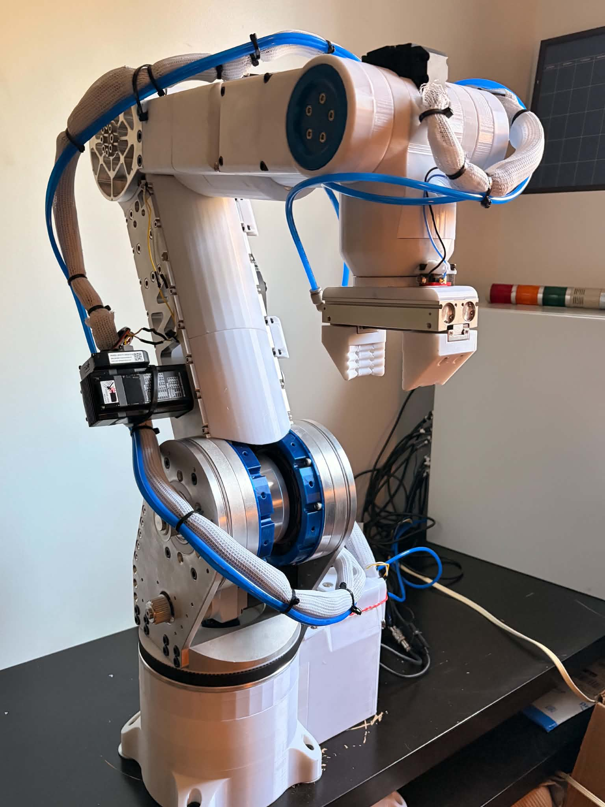
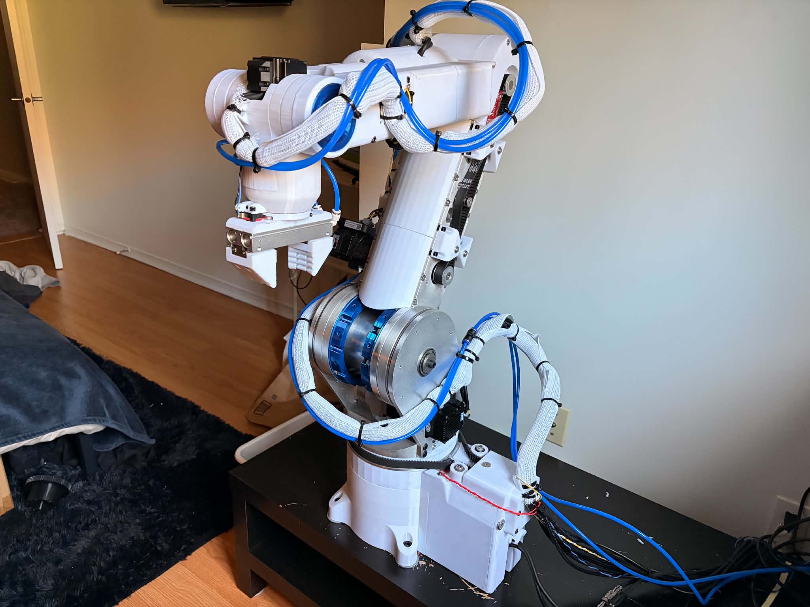
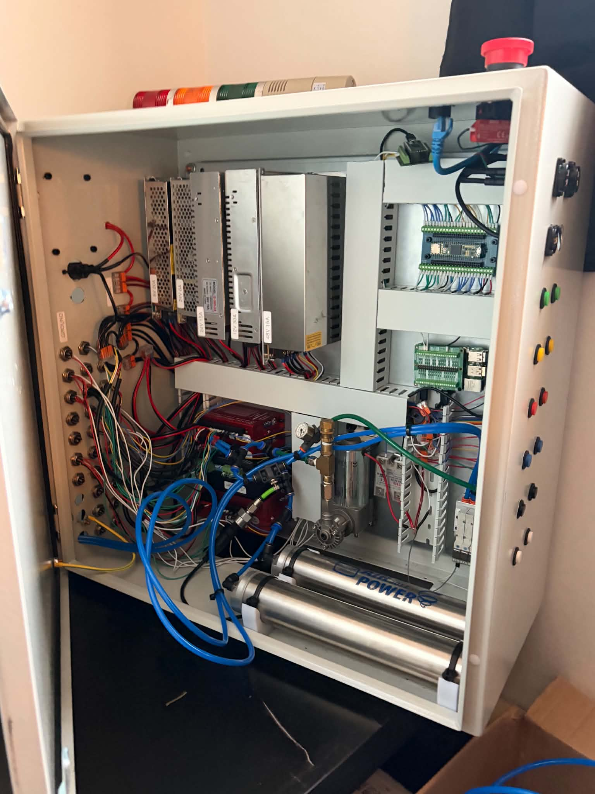
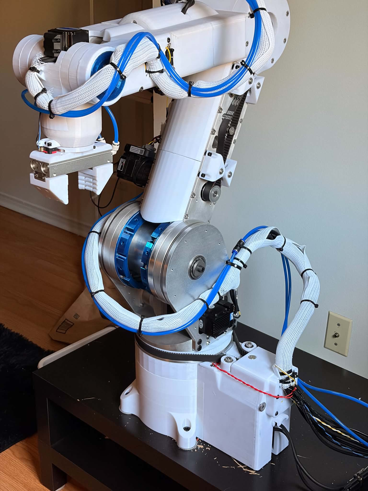

# 6AR - Open-Source 6-Axis Robotic Arm

**6AR** is a DIY, industrial-class, open-source **6-axis robotic arm** designed from scratch for **high performance, reliability, and modularity** — without the industrial price tag.

It is powered by a **Teensy 4.1** real-time motion controller, a **Raspberry Pi 5** bridge server, and a **React + TypeScript + Vite** control interface with a live 3D viewer.
The goal: a robot that _feels_ and _behaves_ like a professional manipulator, but can be built and improved by anyone.

> Born from a personal challenge: _“Could I build an industrial-grade manipulator with open-source tools?”_
> The answer — yes. And now it’s open for anyone to build, improve, and make their own.

---

## Live UI Demo

[Live UI Demo](https://6ar.fabinnov.ca/)

## Robot Gallery

<table>
  <tr>
    <td></td>
    <td></td>
  </tr>
  <tr>
    <td></td>
    <td></td>
  </tr>
</table>

## 🎯 Vision & Motivation

The **6AR** is meant to **mimic the experience of using a professional 6-axis industrial robot**, while staying:

- **Accurate & Smooth** – coordinated multi-axis motion with trapezoidal/jerk-limited profiles
- **Fully Programmable** – Cartesian and joint moves, block-based editor, or raw API
- **Real-Time** – deterministic step pulse generation at kHz rates
- **Networked** – control over Socket.IO or directly via JSON serial
- **Affordable** – a fraction of commercial prices, with off-the-shelf and 3D-printable parts
- **Extensible** – hardware, firmware, UI, and motion planner are modular

This isn’t a toy arm. It’s meant to **run real automation** — but also to be hackable, understandable, and _yours_.

I hope this becomes a **community project** with:

- 🧠 Shared development and faster feature growth
- 📦 Swap-in end-effectors, tools, sensors
- 📚 Tutorials for kinematics, controls, UI/UX
- 🤝 Helping new builders get their first robot moving

---

## 📦 Specs

| Parameter       | Value                     |
| --------------- | ------------------------- |
| Payload         | \~15 kg @ 1000 mm reach   |
| Reach           | 1000 mm                   |
| Robot weight    | \~60 kg                   |
| Control box     | \~25 kg                   |
| Total cost      | \~6000 CAD (materials)    |
| Dev time so far | \~8 months full-time      |
| Baud rate       | 921 600 bps (Pi ↔ Teensy) |

---

## 📊 Features – How 6AR Compares

| Feature / Capability                | 6AR – Open Source |   Typical DIY Arm    |  Industrial Arm  |
| ----------------------------------- | :---------------: | :------------------: | :--------------: |
| **6DOF + Spherical Wrist**          |        ✅         |  ⚠️ (often 3–5 DOF)  |        ✅        |
| **Full Pose IK (Pos + Ori)**        |        ✅         |          ❌          |        ✅        |
| **Joint & Cartesian Motion**        |        ✅         |   ⚠️ (joint only)    |        ✅        |
| **Linear & Circular Paths**         |        ✅         |          ❌          |        ✅        |
| **Trapezoidal Velocity**            |        ✅         |   ⚠️ (basic accel)   |        ✅        |
| **Batch Trajectory Exec**           |        ✅         |          ❌          |        ✅        |
| **Jerk-Limited Jogging**            |        ✅         |          ❌          |        ✅        |
| **Real-Time Stepper/Servo Control** |        ✅         | ⚠️ (firmware delays) |        ✅        |
| **+16 Digital IO Control**          |        ✅         |          ⚠️          |        ✅        |
| **Integrated Pneumatics**           |        ✅         |          ❌          |        ✅        |
| **URDF + Live 3D Viewer**           |        ✅         |          ❌          |        ✅        |
| **Web-Based UI**                    |        ✅         |      ⚠️ (basic)      | ⚠️ (proprietary) |
| **Drag-and-Drop Programming**       |        ✅         |          ❌          | ⚠️ (add-on cost) |
| **Text Based Programming**          |        ✅         |          ❌          |        ✅        |
| **Homing w/ Backoff & Offset**      |        ✅         |      ⚠️ (basic)      |        ✅        |
| **Absolute Encoder Ready**          |    🚧 Planned     |          ❌          |        ✅        |
| **ROS2 / Vision Ready**             |    🚧 Planned     |          ❌          |        ✅        |
| **7th Axis Capabilities**           |    🚧 Planned     |          ❌          | ⚠️ (add-on cost) |

✅ = Full support ⚠️ = Partial / Basic ❌ = Not supported 🚧 = Planned

---

### 🔩 Joint Details

| Joint | Drive Type                                          | Torque (Nm) | Max Speed (°/s) |
| ----- | --------------------------------------------------- | ----------- | --------------- |
| J1    | Belt + NEMA 34 closed-loop                          | 154         | 110             |
| J2    | ISV57T servo + planetary gearbox + belt + cycloidal | 270         | 45              |
| J3    | ISV57T servo + planetary gearbox + belt + cycloidal | 170         | 45              |
| J4    | NEMA 23 + cycloidal                                 | 84          | 250             |
| J5    | NEMA 23 + planetary gearbox                         | 24          | 240             |
| J6    | NEMA 23 + planetary gearbox                         | 12          | 720             |
| J7    | Linear rail (planned)                               | TBD         | TBD             |

---

## 🛠️ Architecture Overview

```bash
6AR/
├── 1-firmware/        # Teensy 4.1 - PlatformIO/Arduino motion firmware
├── 2-pi-bridge/       # Node.js + Python - Socket.IO, UART, FK/IK, trajectories
├── 3-frontend/        # React 19 + TypeScript + Vite operator UI
└── 4-documentation/   # Full developer docs, setup guides, glossary
```

### Quick Start

Firmware:

```bash
cd 1-firmware
pio run
pio run --target upload
```

Pi bridge:

```bash
cd 2-pi-bridge
npm install
python3 -m venv venv
source venv/bin/activate
pip install -r requirements.txt
node server.js
```

Frontend dev UI:

```bash
cd 3-frontend
npm install
VITE_SOCKET_URL=http://localhost:5001 npm run dev
```

The bridge listens on `0.0.0.0:5001` and talks to the Teensy on `/dev/ttyAMA0` at `921600` baud.

---

## 📂 Documentation

All docs are in [`4-documentation/`](./4-documentation):

| File                                                                       | Description                                         |
| -------------------------------------------------------------------------- | --------------------------------------------------- |
| [`1-Teensy-Code-Overview.md`](./4-documentation/1-Teensy-Code-Overview.md) | Managers, motion control loop, safety               |
| [`1-Teensy-Serial-API.md`](./4-documentation/1-Teensy-Serial-API.md)       | JSON commands (e.g. `MoveMultiple`, `Jog`, `Home`)  |
| [`2-Pi-Bridge-Overview.md`](./4-documentation/2-Pi-Bridge-Overview.md)     | Node.js server, Python kinematics, Socket.IO events |
| [`3-Frontend-Overview.md`](./4-documentation/3-Frontend-Overview.md)       | React layout, `useData`, 3D viewer, event flow      |
| [`4-Setup-Guide.md`](./4-documentation/4-Setup-Guide.md)                   | Build → wire → flash → run                          |
| [`5-Developer-Notes.md`](./4-documentation/5-Developer-Notes.md)           | Coding style, naming, structure                     |
| [`6-Glossary.md`](./4-documentation/6-Glossary.md)                         | Acronyms, commands, robotics terms                  |

---

## 🌐 Tech Stack

- **MCU** – [Teensy 4.1](https://www.pjrc.com/store/teensy41.html) @ 600 MHz
- **Host** – Raspberry Pi 5
- **Frontend** – React 19 + TypeScript + Vite + Tailwind CSS + Radix/shadcn-style UI + Three.js
- **Backend** – Node.js + Express + Socket.IO + Python 3 (Robotics Toolbox)
- **Comms** – JSON over Serial (921 600 bps) + Socket.IO
- **Motion Control** – Step/Dir closed-loop drivers + ISV57T servos
- **Pneumatics** – Onboard compressor + SMC MH2F-16D2 gripper

---

## 💬 Community & Development

This started as a **solo build**, but the goal is to make it **community-driven**:

- 🛠 Build your own?
- 🧠 Add firmware/UI/motion planner features?
- 🎓 Using this for teaching?
- 🤖 Add ROS2, vision, or tool changers?

Issues, PRs, and collaboration welcome.

---

## 🌍 Social Media & Community

Stay connected, share your build, and join the growing **6AR Robotics** community:

| Platform         | Link                                                                                          |
| ---------------- | --------------------------------------------------------------------------------------------- |
| 💬 **Discord**   | [Join our Discord Server](https://discord.gg/hdVzqNKb)                                        |
| ▶️ **YouTube**   | [6AR Robotics on YouTube](https://www.youtube.com/@6ARRobotics)                               |
| 👽 **Reddit**    | [r/6AR\_Robotics](https://www.reddit.com/r/6AR_Robotics/)                                     |
| 💻 **GitHub**    | [6AR – Open Source 6-Axis Robot](https://github.com/fabien-prog/6AR-Open-Source-6-Axis-Robot) |
| 📘 **Facebook**  | [6AR Robotics on Facebook](https://www.facebook.com/profile.php?id=61579199611376)            |
| 🎵 **TikTok**    | [6AR Robotics on TikTok](https://www.tiktok.com/@6ar_robotics)                                |
| 📸 **Instagram** | [@6ar\_robotics](https://www.instagram.com/6ar_robotics)                                      |

---


## 📜 License

MIT — free to use, modify, and distribute.

---

## 📍 Next Milestones

- [x] Drag-and-drop programming UI (proof of concept)
- [x] Full-pose IK + TCP motion profiler (working)
- [x] Pneumatic gripper control (working)
- [x] React/Vite controller UI v2 with robot/program/run workspaces
- [x] Revise J2-J3 CAD, manufacture the parts, and assembly!
- [x] URDF mesh optimization + joint limits
- [ ] Joint feedback with absolute encoders + PID
- [ ] Public CAD, BOM, and build documentation

---

Built with **joy**, **frustration**, tens of thousands of lines of code, and a few cracked tables.
(_The arm now lives on a steel plate — the inertia was too intense._)

**– Fabien** (_Stayin_alive_ah on Reddit / 6AR-Robotics on Instagram & YouTube_) 🦾

---
